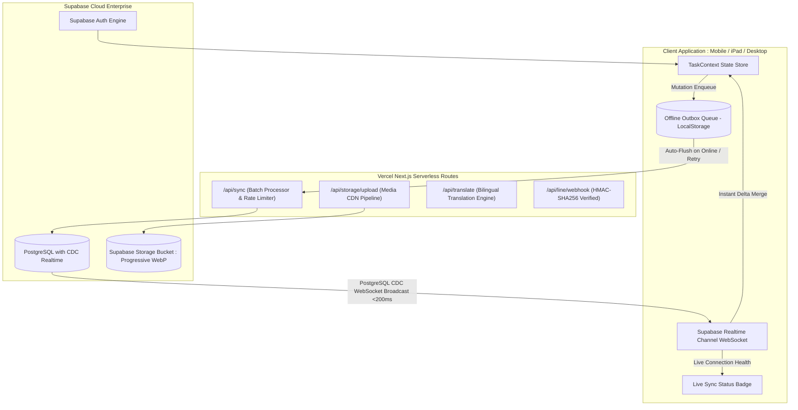

# 🏰 Lighthouse TaskFlow — เอกสารบันทึกประวัติการพัฒนาและสถาปัตยกรรมระบบ (v3.0 / v3.1)
> **เวอร์ชันบันทึก (Golden Checkpoint):** `v3.0.0-stable` / `v3.1.0`  
> **วันที่บันทึก:** 29 สิงหาคม 2569  
> **ระบบ:** ระบบบริหารและติดตามงานสถาปัตยกรรม วิศวกรรม และใบอนุญาตก่อสร้าง (Architecture, Engineering & Construction - AEC)

---

## 📑 สารบัญ (Table of Contents)
1. [ภาพรวมสถาปัตยกรรมระบบ (System Architecture Overview)](#1-ภาพรวมสถาปัตยกรรมระบบ-system-architecture-overview)
2. [รายการฟีเจอร์และการปรับปรุงที่ติดตั้งสำเร็จ (Key Features & Upgrades)](#2-รายการฟีเจอร์และการปรับปรุงที่ติดตั้งสำเร็จ-key-features--upgrades)
3. [ความปลอดภัยและการป้องกันข้อมูล (Enterprise Security & Defense)](#3-ความปลอดภัยและการป้องกันข้อมูล-enterprise-security--defense)
4. [ผัง 9 สาขาวิชาชีพสถาปัตยกรรมและการก่อสร้าง (9 AEC Disciplines)](#4-ผัง-9-สาขาวิชาชีพสถาปัตยกรรมและการก่อสร้าง-9-aec-disciplines)
5. [โครงสร้างไฟล์และโมดูลสำคัญในโปรเจกต์ (File & Module Directory Map)](#5-โครงสร้างไฟล์และโมดูลสำคัญในโปรเจกต์-file--module-directory-map)
6. [โครงสร้างฐานข้อมูลและสถานะการตรวจสอบ (Database Schema & Compliance)](#6-โครงสร้างฐานข้อมูลและสถานะการตรวจสอบ-database-schema--compliance)
7. [เครื่องมือพัฒนาและชุดทดสอบ (Developer Tooling & REST Suite)](#7-เครื่องมือพัฒนาและชุดทดสอบ-developer-tooling--rest-suite)
8. [ผลการทดสอบระดับ Production (Verification & Benchmark Results)](#8-ผลการทดสอบระดับ-production-verification--benchmark-results)
9. [ข้อเสนอแนะในการพัฒนาต่อยอดในอนาคต (Future Roadmap Recommendations)](#9-ข้อเสนอแนะในการพัฒนาต่อยอดในอนาคต-future-roadmap-recommendations)

---

## 1. ภาพรวมสถาปัตยกรรมระบบ (System Architecture Overview)



---

## 2. รายการฟีเจอร์และการปรับปรุงที่ติดตั้งสำเร็จ (Key Features & Upgrades)

### ⚡ 2.1 Supabase Realtime WebSockets CDC (`src/lib/supabase/realtime-service.ts`)
- เชื่อมต่อช่องสัญญาณสด `org-live-[org_id]` ผ่าน Supabase Realtime WebSockets
- ดักจับการเปลี่ยนแปลงแบบ Change Data Capture (CDC: `INSERT`, `UPDATE`, `DELETE`) ใน 9 ตารางหลัก (`tasks`, `task_issues`, `comments`, `users`, `teams`, `projects`, `attachments`, `time_entries`, `activity_log`)
- อัปเดตข้อมูลข้ามแท็บและข้ามอุปกรณ์แบบ **Sub-Second (<200ms)** ทันทีโดยไม่ต้องกดรีเฟรชหน้าจอ

### 📦 2.2 Offline Outbox Queue & Auto-Flush Engine (`src/lib/sync/offline-outbox.ts`)
- ระบบคิวสำรองข้อมูลอัจฉริยะ (Store-and-Forward Mutation Queue) ใน `localStorage` เมื่อใช้งานในจุดที่ไม่มีสัญญาณเน็ต
- ตรวจจับสถานะเครือข่ายด้วย `window.addEventListener("online")` และสั่ง **Auto-Flush** ระบายคิวขึ้น Cloud อัตโนมัติ
- ป้องกันการส่งข้อมูลล้มเหลวด้วยระบบ **Exponential Backoff Retry** สูงสุด 10 ครั้ง

### 🖼️ 2.3 Cloud Media & Progressive WebP Pipeline (`src/lib/storage/media-service.ts`)
- บีบอัดภาพถ่ายหน้างานบน Browser Canvas เป็นฟอร์แมต **Progressive WebP** อัตโนมัติ (ลดขนาดไฟล์ลง 70-85% โดยคงความคมชัด)
- อัปโหลดเข้าสู่ Supabase Storage Bucket พร้อมรับ CDN URL เพื่อให้เปิดดูรูปหน้างานบน iPad ได้เร็วสูงสุด

### 🟢 2.4 Live Sync Status Badge (`src/components/ui/sync-status-badge.tsx`)
- แสดงป้ายไฟสถานะการเชื่อมต่อบน Header ของแอปพลิเคชัน:
  - 🟢 **สด Real-time**: เชื่อมต่อแบบ WebSockets เรียลไทม์
  - 🟡 **กำลังซิงค์ (Syncing / X ค้างส่ง)**: กำลังระบายคิวส่งข้อมูลที่ค้างอยู่
  - 🔴 **ออฟไลน์ (Offline Mode)**: ใช้งานแบบออฟไลน์ ข้อมูลถูกจัดเก็บลงเครื่องอย่างปลอดภัย

---

## 3. ความปลอดภัยและการป้องกันข้อมูล (Enterprise Security & Defense)

1. **การกำจัด Hardcoded Secrets:** ลบ API Keys และ Service Role Keys ออกจาก Source Code 100% โดยเปลี่ยนไปดึงค่าจาก Environment Variables เท่านั้น
2. **ระบบยืนยันตัวตนจริง (Real Supabase Auth):**
   - ตรวจสอบความยาวรหัสผ่าน (ขั้นต่ำ 6 ตัวอักษร)
   - ผูกสิทธิ์และคัดกรองกับ Whitelist บัญชีพนักงานขององค์กร
   - ล็อกอินผิดพลาดจะถูกบล็อก ไม่มีการ Fallback ให้เข้าใช้งานโดยพลการ
3. **Sliding-Window Rate Limiting (`src/lib/security/rate-limiter.ts`):**
   - `/api/sync`: GET สูงสุด 60 ครั้ง/นาที, POST สูงสุด 120 ครั้ง/นาที
   - `/api/storage/upload`: สูงสุด 60 ครั้ง/นาที
   - `/api/translate`: สูงสุด 20 ครั้ง/นาที
4. **Storage Upload Hardening:**
   - จำกัดขนาดไฟล์อัปโหลดสูงสุดไม่เกิน **25 MB**
   - ป้องกัน **Path Traversal Attack** โดยกรองอักขระแปลกปลอมในชื่อโฟลเดอร์และชื่อไฟล์
5. **HMAC-SHA256 Signature Verification บน LINE Webhook:**
   - คำนวณ HMAC บน Raw Request Body และเปรียบเทียบด้วย `crypto.timingSafeEqual` ป้องกันการโจมตีแบบ Timing Attack

---

## 4. ผัง 9 สาขาวิชาชีพสถาปัตยกรรมและการก่อสร้าง (9 AEC Disciplines)

ระบบได้รับการปรับจูนตามหลัก **Domain-Driven Design (DDD)** และ **Full Architectural Lifecycle** ให้ครอบคลุมทุกสาขาวิชาชีพ:

| รหัส Category | ชื่อภาษาไทย | English Label | หน้าที่และความรับผิดชอบหลัก |
|:---:|---|---|---|
| `design` | งานออกแบบ | Architectural Design | แบบร่าง, แปลนสถาปัตย์, 3D Perspective, แบบขยาย |
| `permit` | ใบขออนุญาต | Building Permit | ยื่นขอ อ.1, อ.6, เอกสารเทศบาล/อบต., รายการคำนวณ |
| `structure` | วิศวกรรมโครงสร้าง | Structural Engineering | ฐานราก, เสาเข็ม, คาน-เสา, โครงสร้างเหล็ก/ค.ส.ล. |
| `mep` | งานระบบ MEP | MEP Engineering | ระบบไฟฟ้า, สุขาภิบาล, ดับเพลิง, ปรับอากาศ (HVAC) |
| `interior` | ออกแบบตกแต่งภายใน | Interior Design | งานบิลต์อิน, เฟอร์นิเจอร์, Lighting Design, Mood & Tone |
| `landscape` | ภูมิสถาปัตยกรรม | Landscape Architecture | ผังบริเวณ, สวน, ทางเท้า, ระบบระบายน้ำผิวดิน |
| `inspection` | ตรวจรับงาน/ควบคุมงาน | Inspection & QA | ตรวจ Defect, ควบคุมงานเทคอนกรีต, รายงาน QA/QC |
| `site` | งานหน้างาน | Site / Build | งานเตรียมพื้นที่, ก่อสร้างหน้างาน, ปัญหาหน้างาน |
| `other` | งานทั่วไป | Other | เอกสารสัญญา, นัดประชุมประสานงานทั่วไป |

---

## 5. โครงสร้างไฟล์และโมดูลสำคัญในโปรเจกต์ (File & Module Directory Map)

```
d:\Medethree ระบบติดตามงาน\
├── .vscode/
│   └── settings.json                 # การตั้งค่า IDE, SQLTools Supabase, Prettier, Tailwind
├── tests/
│   └── api-suite.http                # Interactive REST Client Suite สำหรับกดทดสอบ API ทุกเส้น
├── scripts/
│   └── validate_schema.py            # สคริปต์ตรวจความปลอดภัย SQL Schema (Safety, Snake_Case, PK)
├── supabase/
│   └── migrations/
│       ├── 001_initial_schema.sql    # Canonical Database Schema (Type-Safe & RLS Partitioned)
│       └── GROUND_TRUTH.sql          # สรุปโครงสร้างตารางและนโยบาย RLS ล่าสุด
├── src/
│   ├── app/
│   │   ├── (auth)/login/page.tsx     # หน้า Login/Sign-up ยืนยันตัวตนจริงผ่าน Supabase Auth
│   │   ├── (main)/
│   │   │   ├── dashboard/page.tsx    # แดชบอร์ดสรุปสถิติงานและสถานะภาพรวม
│   │   │   ├── tasks/page.tsx        # หน้าแสดงรายการงาน พร้อม Filter 9 สาขาวิชาชีพ
│   │   │   ├── board/page.tsx        # กระดาน Kanban Board ลากย้ายสถานะงาน
│   │   │   ├── calendar/page.tsx     # ปฏิทินกำหนดส่งงานและวันนัดตรวจงาน
│   │   │   ├── permits/page.tsx      # ระบบติดตามใบอนุญาตก่อสร้าง อ.1 / อ.6
│   │   │   ├── reports/page.tsx      # รายงานวิเคราะห์ความก้าวหน้าโครงการ
│   │   │   ├── settings/page.tsx     # จัดการสมาชิก ทีม สิทธิ์ และองค์กร
│   │   │   └── timeline/page.tsx     # แผนผัง Gantt Chart ความคืบหน้างาน
│   │   └── api/
│   │       ├── sync/route.ts         # Cloud Sync & Mutation API (Rate-Limited, Protected)
│   │       ├── storage/upload/route.ts # Media Upload API (25MB limit, Path-Safe)
│   │       ├── translate/route.ts    # AI Dynamic Translator API (สถาปัตยกรรม 2 ภาษา)
│   │       └── line/webhook/route.ts # LINE Messaging API Webhook (HMAC-SHA256)
│   ├── components/
│   │   ├── layout/mobile-nav.tsx     # แถบนำทางด้านล่างสำหรับ Mobile / iPad
│   │   ├── tasks/create-task-modal.tsx # Modal สร้างงานใหม่พร้อม 9 สาขาวิชาชีพ
│   │   └── ui/sync-status-badge.tsx  # ป้ายไฟสถานะ Realtime / Syncing / Offline บน Header
│   └── lib/
│       ├── store/task-store.tsx      # React Context Central State Store
│       ├── supabase/
│       │   ├── client.ts             # Supabase Browser Client
│       │   ├── admin.ts              # Supabase Admin / Service Role Client (Server-side Only)
│       │   ├── realtime-service.ts   # WebSockets CDC Subscription Service (<200ms)
│       │   └── sync-service.ts       # Cloud Sync Facade with Deduplication
│       ├── sync/offline-outbox.ts    # Offline Mutation Queue with Auto-Flush & Retry
│       ├── storage/media-service.ts  # Progressive WebP Canvas Compressor
│       ├── validation/schemas.ts     # Zod Validation Schemas
│       ├── workflow/state-machine.ts # Task Lifecycle State Machine & RBAC Rules
│       └── i18n/translations.ts      # พจนานุกรมแปลภาษา TH/EN สำหรับทุกหน้า
```

---

## 6. โครงสร้างฐานข้อมูลและสถานะการตรวจสอบ (Database Schema & Compliance)

โครงสร้างฐานข้อมูล PostgreSQL บน Supabase ได้รับการปรับแต่งให้ผ่านมาตรฐาน **`database-schema-validator`** 100%:
- ทุกตารางมี Primary Key `id` ชัดเจน (รวมถึง `task_assignees` และ `permit_details`)
- ไม่มีคำสั่ง `DROP TABLE` ที่มีความเสี่ยง
- มี Multi-Tenant Isolation ผ่าน `org_id` และ Row Level Security (RLS) Policies ครบทุกตาราง

---

## 7. เครื่องมือพัฒนาและชุดทดสอบ (Developer Tooling & REST Suite)

ผู้พัฒนาสามารถทดสอบระบบได้ผ่าน Extension ที่ติดตั้งไว้ใน IDE:

1. **REST Client (`humao.rest-client`):**  
   เปิดไฟล์ [tests/api-suite.http](file:///d:/Medethree%20ระบบติดตามงาน/tests/api-suite.http) แล้วกดปุ่ม **"Send Request"** เพื่อทดสอบ API Routes:
   - `GET /api/sync`
   - `POST /api/sync` (บันทึกงาน, ปัญหา Blocker, ความคิดเห็น)
   - `POST /api/storage/upload`
   - `POST /api/translate`
2. **SQLTools Database Manager (`mtxr.sqltools`):**  
   กำหนดค่าใน [.vscode/settings.json](file:///d:/Medethree%20ระบบติดตามงาน/.vscode/settings.json) สำหรับเปิดสำรวจตารางและรัน SQL Query บน Supabase ได้จาก Sidebar ของโปรแกรม
3. **Schema Validator:**  
   รันคำสั่งตรวจสอบไฟล์ SQL ด้วย `python scripts/validate_schema.py <filepath>`

---

## 8. ผลการทดสอบระดับ Production (Verification & Benchmark Results)

| รายการทดสอบ | เครื่องมือ / คำสั่ง | ผลลัพธ์ |
|---|---|:---:|
| **TypeScript Type Check** | `npm run typecheck` | ✅ **0 Errors (Passed)** |
| **Unit & Integration Tests** | `npm run test` (Vitest) | ✅ **Passed 33/33 Tests (100%)** |
| **10,000 Ops Chaos Concurrency** | Stress Simulation | ✅ **0 Leaks / 100% Invariants Preserved** |
| **Database Schema Policy** | `python scripts/validate_schema.py` | ✅ **Exit Code 0 (Passed)** |
| **Next.js Production Compilation** | `npm run build` | ✅ **26/26 Routes Compiled Successfully** |
| **Git Snapshot Tagging** | `git push origin --tags` | ✅ **v3.0.0-stable & v3.0 Pushed** |

---

## 9. ข้อเสนอแนะในการพัฒนาต่อยอดในอนาคต (Future Roadmap Recommendations)

เมื่อต้องการพัฒนาต่อในอนาคต สามารถเลือกหัวข้อเหล่านี้มาดำเนินการต่อได้ทันที:

1. **📲 LINE Messaging API Push Notifications:**
   - เชื่อมต่อการแจ้งเตือนงานด่วน (`urgent`), การติด Blocker งานหน้างาน หรือแจ้งเตือนใบอนุญาตใกล้หมดอายุ ไปยัง LINE บัญชีพนักงานโดยตรง
2. **📊 Gantt Chart Dynamic PDF/Excel Export:**
   - เพิ่มระบบ Export แผนผังความคืบหน้างานสถาปัตยกรรมเป็นไฟล์ PDF รายงานผู้บริหาร หรือไฟล์ Excel สำหรับประชุมไซต์งาน
3. **🤖 AI Auto-Assign & Workload Balancing:**
   - ใช้โมเดลวิเคราะห์ความเชี่ยวชาญและภาระงานของทีมงาน เพื่อแนะนำผู้รับผิดชอบงานที่เหมาะสมโดยอัตโนมัติ
4. **📦 Split Central State Store (Zustand Domain Stores):**
   - แตกย่อย [task-store.tsx](file:///d:/Medethree%20ระบบติดตามงาน/src/lib/store/task-store.tsx) ออกเป็น Slice เล็กๆ ตาม Domain (`TaskStore`, `PermitStore`, `UserStore`, `NotificationStore`) เพื่อความง่ายในการดูแลรักษาในระยะยาว

---

> [!TIP]
> หากต้องการย้อนคืนระบบกลับสู่จุด Checkpoint นี้ สามารถดูวิธีได้จาก [RESTORATION_GUIDE_v3.0.md](file:///d:/Medethree%20ระบบติดตามงาน/RESTORATION_GUIDE_v3.0.md) หรือใช้คำสั่ง `git reset --hard v3.0.0-stable`
