# 🏰 LIGHTHOUSE TASKFLOW: MASTER SYSTEM SPECIFICATION & ARCHITECTURE BLUEPRINT
> **ระบบบริหารจัดการโครงการและติดตามงานก่อสร้าง-สถาปัตยกรรม (MeDTree Design & Build)**  
> *เอกสารสรุปภาพรวมระบบ, ปรัชญาการออกแบบ, ฟีเจอร์ทั้งหมด, โครงสร้างหน้าบ้าน-หลังบ้าน และแนวทางการพัฒนาต่อสำหรับ AI Agent และวิศวกรซอฟต์แวร์*

---

## 1. บทนำและความเป็นมา (Executive Summary & Background)

**Lighthouse TaskFlow (v2.1)** ถูกพัฒนาขึ้นเพื่อเป็นศูนย์กลางการบริหารจัดการงาน (Single Source of Truth) สำหรับบริษัท **MeDTree Design & Build** โดยมีเป้าหมายหลักคือ:
1. ขจัดปัญหา "งานหลุด ปัญหาหน้างานไม่ถูกสื่อสาร และใบอนุญาตติดขัด" ในโครงการก่อสร้างและสถาปัตยกรรม
2. เชื่อมโยงทีมงาน 4 ฝ่ายเข้าด้วยกันอย่างไร้รอยต่อ: **ผู้บริหาร (Admin/Executive)**, **ผู้จัดการโครงการ (Project Manager)**, **สถาปนิก/วิศวกร (Designers & Engineers)**, และ **ช่าง/โฟร์แมนหน้างาน (Site Foremen)**
3. รองรับการทำงาน 2 ภาษา (**ไทย 🇹🇭 / อังกฤษ 🇬🇧**) ด้วยระบบแปลภาษาอัจฉริยะ AI ในทุกจุดสำคัญ
4. ทำงานได้อย่างเสถียรบนทุกอุปกรณ์ (Desktop, iPad, Mobile) พร้อมเชื่อมต่อแจ้งเตือนแบบเรียลไทม์ผ่าน **LINE Push Notification**, **Resend Email**, และ **In-App Notification Bell**

---

## 2. ปรัชญาและแนวคิดหลักในการออกแบบ (Core Design Philosophy)

### 🌿 2.1 เน้นผลงานจริง ไม่จับเวลากดดัน (Deliverable-Centric, Stress-Free UX)
- **ตัดระบบจับเวลานับถอยหลัง / Stopwatch ออก 100%**: การจับเวลานาทีต่อนาทีสร้างความเครียดและเป็นอุปสรรคต่อช่างหน้างานและสถาปนิก
- **มุ่งเน้น 2 สิ่งสำคัญ**:
  1. **ผลงานส่งมอบ (Deliverables)**: รูปถ่ายหน้างาน, ไฟล์แบบ CAD, ไฟล์ PDF, ภาพ Perspective 3D
  2. **การปลดบล็อกปัญหา (Blockers & Issues)**: การแจ้งปัญหาท่อชนคาน, ระยะร่นไม่พอ, หรือการแก้ไขแบบ เพื่อให้ผู้มีอำนาจตัดสินใจแก้ปัญหาได้ทันที

### 🛡️ 2.2 บันทึกที่มาที่ไปและประวัติผู้แก้ไข (Resolver Provenance & Audit Trail)
- ทุกปัญหาติดขัด (Issue/Blocker) เมื่อได้รับการแก้ไขแล้ว จะต้องระบุอย่างโปร่งใสว่า **ใครเป็นคนแก้ (Resolver Name)**, **ตำแหน่งใด (Role)**, **แก้ไขเมื่อไหร่ (Timestamp)**, และ **ใช้วิธีใดแก้ไข (Resolution Method)**
- ระบบจะเคลียร์สถานะสีแดงอัตโนมัติ ไม่มีการแจ้งเตือนค้างเตือนซ้ำซ้อน

### ☁️ 2.3 สถาปัตยกรรมลูกผสม คลาวด์ + โลคอล แคช (Resilient Hybrid Cloud Architecture)
- ระบบเชื่อมต่อกับ **Supabase PostgreSQL Cloud DB**
- พร้อมระบบ **Safe Local Storage Merge** ป้องกันข้อมูลงานและสถานะการแก้ปัญหาหายเมื่อผู้ใช้กดรีเฟรชหน้าจอ (F5) หรือในกรณีที่โครงข่ายอินเทอร์เน็ตหน้างานไม่เสถียร

### 🌐 2.4 ระบบแปลภาษา AI แบบหลายเครื่องยนต์ (Multi-Engine AI Translation Cascade)
- ทำงานอัตโนมัติ แปลประโยคภาษาไทยยาวๆ เป็นภาษาอังกฤษระดับวิชาชีพสถาปัตยกรรม/วิศวกรรมใน **0.3 วินาที**
- มีระบบรองรับแบบ Cascade (Google Gemini API ➔ MyMemory Universal API ➔ Architectural Polisher ➔ Domain Dictionary) ทำให้ระบบแปลภาษาทำงานได้ **100% เสมอโดยไม่มีวันล่ม**

---

## 3. แผนผังฟีเจอร์ทั้งหมดของระบบ (Full Features Map)

```mermaid
graph TD
    A[Lighthouse TaskFlow] --> B[🔐 Authentication & RBAC]
    A --> C[📋 Unified Task Management]
    A --> D[🚨 Issues & Blockers System]
    A --> E[📁 Deliverables & Comments]
    A --> F[📜 Permit Milestone Lifecycle]
    A --> G[📊 Executive Dashboard & KPIs]
    A --> H[🔔 Multi-Channel Notification]
    A --> I[⚙️ Settings & Governance]

    B --> B1[Email Whitelist Auth]
    B --> B2[Role Guard: Admin/Manager/Member/Viewer]
    
    C --> C1[Table View with Direct Actions]
    C --> C2[Kanban Board View]
    C --> C3[Calendar View]
    C --> C4[My Tasks Filter View]

    D --> D1[Quick Blocker Logger]
    D --> D2[Direct Blocker Resolve Modal]
    D --> D3[Resolver Provenance Audit Box]
    D --> D4[Auto-Clearing Urgent Filter]

    E --> E1[File Upload & Smart Size Tracker]
    E --> E2[Bilingual Discussion Thread]

    F --> F1[A.1 / Permit Stage Tracker]
    F --> F2[Revision Round Counter]

    G --> G1[Active Operations KPI]
    G --> G2[Permit Milestone Rate]
    G --> G3[Workload by Team Table]

    H --> H1[Interactive Bell with Direct Deep Link]
    H --> H2[LINE Multi-Executive Push]
    H --> H3[Resend HTML Email]

    I --> I1[Admin-Only Access Guard]
    I --> I2[Member Management & LINE ID Binding]
    I --> I3[Instant Push Notification Tester]
```



### รายละเอียดฟีเจอร์ตามหมวดหมู่:

1. **ระบบยืนยันตัวตนและการจัดการสิทธิ์ (Authentication & RBAC)**:
   - ตรวจสอบอีเมลกับฐานข้อมูล WhiteList ของบริษัท (`allowed_emails` ใน Supabase / default users)
   - หน้า Login แยกแท็บชัดเจนระหว่าง **"🔑 อีเมล / รหัสผ่าน"** และ **"🚀 Demo Fast-Login"**
   - ผู้ใช้ใหม่สามารถตั้งรหัสผ่านของตนเองได้ในการเข้าใช้งานครั้งแรก (First-Time Activation)
   - แบ่งสิทธิ์เป็น 4 ระดับ:
     - `admin`: สิทธิ์สูงสุด จัดการสมาชิก, ตั้งค่า LINE, ลบงาน, เข้าเมนู Settings
     - `manager`: จัดการงาน, อนุมัติแบบ, มอบหมายงาน, รับการแจ้งเตือนปัญหา
     - `member`: ปฏิบัติงาน, ส่งงาน, บันทึกปัญหา, ปลดบล็อกปัญหา
     - `viewer`: ดูข้อมูลโครงการและติดตามความคืบหน้า (Read-Only)

2. **ระบบจัดการงาน 5 มิติ (Unified Task Management)**:
   - **ตารางงาน (Table View)**: แสดงชื่องาน, โครงการ, สถานะ, ความสำคัญ, ผู้รับผิดชอบ, กำหนดส่ง พร้อมปุ่มด่วน **`[ 📁 แนบไฟล์ ]`**, **`[ 🚨 + บันทึกปัญหา ]`**, **`[ ✅ แก้ไขปัญหาแล้ว ]`**, และ **`[ ดูรายละเอียด ]`**
   - **บอร์ดคัมบัง (Kanban Board)**: ลากและสลับสถานะงาน (Todo ➔ In Progress ➔ Review ➔ Completed) พร้อมระบบเช็ค Workflow Gate
   - **ปฏิทินงาน (Calendar View)**: แสดง Deadlines และกำหนดการส่งมอบแบบ
   - **งานของฉัน (My Tasks)**: กรองเฉพาะงานที่ผู้ใช้ปัจจุบันได้รับมอบหมาย
   - **งานที่ติดปัญหา (`/tasks?filter=issues`)**: กรองเฉพาะงานที่มี Active Blocker พร้อมปุ่มกดแก้ปัญหาได้ทันที

3. **ระบบจัดการปัญหาติดขัด & ประวัติผู้แก้ไข (Issues & Resolver Provenance)**:
   - **ปุ่มด่วน `[ ✅ แก้ปัญหาแล้ว ]` ในตารางงาน**: ผู้ใช้สามารถปลดบล็อกงานได้ทันทีจากตารางโดยไม่ต้องคลิกหลายหน้า
   - **Resolver Provenance Box**: บันทึกชื่อจริง + ตำแหน่ง + วันเวลา + แนวทางการแก้ปัญหาอย่างละเอียด
   - **Auto-Clearing Filter**: เมื่อแก้ปัญหาแล้ว งานจะหลุดออกจากตัวกรองงานติดปัญหาทันที และตัวเลขสีแดงมุมล่างซ้ายจะลดลงอัตโนมัติ

4. **ระบบส่งมอบผลงาน & ข้อคิดเห็น (Deliverables & Comments Workspace)**:
   - อัปโหลดไฟล์แบบแปลน, รูปภาพหน้างาน, เอกสาร PDF
   - สนทนาและสรุปงานแยกตาม Task พร้อมปุ่ม AI แปลอังกฤษอัตโนมัติ

5. **ระบบติดตามใบอนุญาตก่อสร้าง (Permit Milestones)**:
   - ติดตามสถานะยื่นขอใบอนุญาตก่อสร้าง อ.1, EIA, ขอน้ำ-ขอไฟ
   - บันทึกประวัติการตีกลับแก้ไข (`revision_round`) พร้อมสรุปแนวทางปรับแก้

6. **ระบบรายงานผู้บริหาร (Executive KPIs & Analytics)**:
   - การ์ดสรุป KPI: งานทั้งหมด, งานสำเร็จ, **งานกำลังดำเนินการ (Active Operations)**, และอัตราผ่านใบอนุญาต (Permit Milestones)
   - ตารางแจกแจง Workload ของแต่ละทีม (สถาปัตย์, โครงสร้าง, งานระบบ, ยื่นขออนุญาต)

7. **ระบบแจ้งเตือนหลายช่องทาง (Multi-Channel Real-Time Notifications)**:
   - **กระดิ่งแจ้งเตือนบน Header**: แสดง Unread Badge + Quick Dropdown 5 รายการล่าสุด + ระบบ Smart Deep Link คลิกแล้วเปิดแท็บตรงจุดเกิดเหตุทันที
   - **LINE Push Notification**: ยิงแจ้งเตือนเข้า LINE กลุ่ม/บุคคลของผู้บริหารและผู้จัดการทันทีที่มีการแจ้ง Blocker หรือมอบหมายงาน
   - **Email Dispatch**: รองรับการส่งอีเมล HTML ผ่าน Resend API

---

## 4. โครงสร้างทางเทคนิค (Technical Architecture)

### 💻 4.1 Tech Stack
- **Framework**: [Next.js 14](https://nextjs.org/) (App Router, Server Components & Client Components)
- **Language**: TypeScript 5.x (Strict Type Checking)
- **Styling**: Tailwind CSS, PostCSS, Lucide React Icons, Radix UI Primitives
- **Database / Cloud**: Supabase PostgreSQL (REST API & Real-time Client)
- **Deployment**: Vercel CI/CD (Production Connected to GitHub `main` branch)
- **Repository**: [https://github.com/meD3-AiSpace/medethree-Taskflow](https://github.com/meD3-AiSpace/medethree-Taskflow)
- **Live URL**: [https://medethree-taskflow.vercel.app](https://medethree-taskflow.vercel.app)

---

### 📂 4.2 โครงสร้างโฟลเดอร์หลัก (Project Directory Tree)

```
d:\Medethree ระบบติดตามงาน\
├── src\
│   ├── app\
│   │   ├── (auth)\
│   │   │   └── login\page.tsx              # หน้าล็อกอิน / สมัครสมาชิก / Whitelist Guard
│   │   ├── (main)\
│   │   │   ├── board\page.tsx              # หน้า Kanban Board
│   │   │   ├── calendar\page.tsx           # หน้าปฏิทินงาน
│   │   │   ├── dashboard\page.tsx          # หน้าแดชบอร์ดหลัก
│   │   │   ├── my-tasks\page.tsx           # หน้ารายการงานของฉัน
│   │   │   ├── notifications\page.tsx      # หน้ารวมประวัติการแจ้งเตือนทั้งหมด
│   │   │   ├── permits\page.tsx            # หน้าระบบติดตามใบอนุญาตก่อสร้าง
│   │   │   ├── reports\page.tsx            # หน้ารายงานสถิติและ KPIs ผู้บริหาร
│   │   │   ├── settings\page.tsx           # หน้าตั้งค่าระบบ & สมาชิก (Admin Only)
│   │   │   ├── tasks\
│   │   │   │   ├── [id]\page.tsx           # หน้ารายละเอียดงาน (Unified 3 Tabs)
│   │   │   │   └── page.tsx                # หน้ารายการงานทั้งหมด (Table + Quick Actions)
│   │   │   ├── teams\page.tsx              # หน้าโครงสร้างองค์กรและทีม
│   │   │   └── layout.tsx                  # Root Main Layout (Sidebar + Header)
│   │   └── api\
│   │       ├── auth\me\route.ts            # API ตรวจสอบ Session ปัจจุบัน
│   │       ├── auth\logout\route.ts        # API ล็อกเอาต์
│   │       ├── email\notify\route.ts       # API ส่งอีเมลผ่าน Resend
│   │       ├── line\notify\route.ts        # API ส่ง LINE Push Message
│   │       ├── line\test-push\route.ts     # API ทดสอบยิง LINE
│   │       ├── line\webhook\route.ts       # API รับ Webhook จาก LINE
│   │       ├── notifications\dispatch\route.ts # API Dispatcher การแจ้งเตือน
│   │       ├── reports\briefing\route.ts   # API สร้าง Executive Daily Briefing
│   │       ├── sync\route.ts               # API ซิงก์ข้อมูลคลาวด์
│   │       ├── tasks\[id]\transition\route.ts # API Workflow Gate Validator
│   │       └── translate\route.ts          # API แปลภาษา AI (Multi-Engine Cascade)
│   ├── components\
│   │   ├── layout\
│   │   │   ├── header.tsx                  # Header Bar (Notif Bell + Language Switcher + User Profile)
│   │   │   └── sidebar.tsx                 # Left Sidebar Navigation + Blocker Red Toast
│   │   ├── tasks\
│   │   │   ├── activity-timeline.tsx       # Timeline ประวัติการเปลี่ยนแปลงงาน
│   │   │   ├── comment-section.tsx         # กระดานสนทนาประจำงาน
│   │   │   ├── create-task-modal.tsx       # ป๊อปอัปสร้างงานใหม่
│   │   │   ├── deliverables-attachment-section.tsx # จัดการไฟล์ผลงาน & รูปภาพ
│   │   │   ├── issue-section.tsx           # แสดงปัญหาและบันทึกการแก้ปัญหาในหน้ารายละเอียด
│   │   │   ├── permit-section.tsx          # รายละเอียดขั้นตอนการขอใบอนุญาต
│   │   │   ├── quick-attach-modal.tsx      # ป๊อปอัปแนบไฟล์ด่วนจากตาราง
│   │   │   ├── quick-issue-modal.tsx       # ป๊อปอัปแจ้งปัญหาด่วนจากตาราง
│   │   │   └── quick-resolve-modal.tsx     # ป๊อปอัปบันทึกการแก้ปัญหาด่วน พร้อม AI & Provenance
│   │   ├── reports\
│   │   │   ├── executive-kpi-cards.tsx     # การ์ดสรุป 4 ตัวชี้วัดผู้บริหาร
│   │   │   └── team-workload-table.tsx     # ตารางภาระงานรายทีม
│   │   └── ui\                             # Reusable UI Primitives (Button, Dialog, Badge, Input, etc.)
│   └── lib\
│       ├── i18n\
│       │   ├── auto-translate.ts           # Client Translation Helper
│       │   ├── dynamic-translator.ts       # Text Localization Fallback
│       │   ├── language-context.tsx        # TH/EN State Context Provider
│       │   └── translations.ts             # Static Language Dictionary
│       ├── store\
│       │   ├── task-store.tsx              # Single Source of Truth (TaskProvider)
│       │   └── supabase-sync.ts            # Supabase Cloud REST Sync Service
│       ├── types\
│       │   └── database.types.ts           # TypeScript Domain & DB Entities
│       ├── validation\
│       │   └── schemas.ts                  # Zod Input Validation Schemas
│       └── utils.ts                        # Helper Utilities (Date formatting, cn, badges)
```

---

### 🗄️ 4.3 โครงสร้างฐานข้อมูล (Database Entities & Schema)

| Table Name | Primary Key | Foreign Keys / Key Columns | Description |
| :--- | :--- | :--- | :--- |
| `organizations` | `id` (uuid) | `name` | องค์กร/บริษัท (Multi-Tenant Org) |
| `teams` | `id` (uuid) | `org_id` ➔ `organizations.id` | แผนก/ฝ่าย (สถาปัตย์, โครงสร้าง, งานระบบ, ขออนุญาต) |
| `users` | `id` (uuid) | `org_id`, `team_id`, `email`, `role`, `line_user_id` | สมาชิกในระบบ พร้อมบทบาทและ LINE UID |
| `projects` | `id` (uuid) | `org_id`, `team_id`, `name` | โครงการก่อสร้าง (เช่น Baan Suay, The Forest Villa) |
| `tasks` | `id` (uuid/text) | `org_id`, `project_id`, `created_by`, `status`, `priority`, `category` | ชื่องาน, กำหนดส่ง, หมวดหมู่ และสถานะ |
| `task_assignees` | `(task_id, user_id)` | `task_id` ➔ `tasks.id`, `user_id` ➔ `users.id` | ผู้รับผิดชอบงาน (รองรับ Multiple Assignees) |
| `task_issues` | `id` (uuid/text) | `task_id`, `raised_by`, `is_resolved`, `resolved_by`, `resolved_at`, `resolution_description` | ปัญหาติดขัดหน้างาน พร้อมบันทึกผู้แก้ไขและวิธีแก้ |
| `task_attachments` | `id` (uuid/text) | `task_id`, `uploaded_by`, `file_name`, `file_url`, `file_type` | ไฟล์ผลงาน, แบบแปลน CAD, รูปถ่ายหน้างาน |
| `comments` | `id` (uuid/text) | `task_id`, `user_id`, `content`, `content_en` | ข้อคิดเห็นและบันทึกสนทนา |
| `activity_logs` | `id` (uuid/text) | `task_id`, `user_id`, `action`, `new_value` | ประวัติ Audit Log การเปลี่ยนแปลงทุกขั้นตอน |
| `notifications` | `id` (uuid/text) | `user_id`, `task_id`, `type`, `title`, `message`, `is_read` | รายการแจ้งเตือนในระบบ |

---

### 🔑 4.4 ตัวแปรสภาพแวดล้อม (Environment Variables - `.env.local`)

```env
# Next.js Application Public URL
NEXT_PUBLIC_APP_URL=https://medethree-taskflow.vercel.app

# Supabase Cloud Database (Multi-Tenant Backend)
NEXT_PUBLIC_SUPABASE_URL=https://nylcflqguzuhuhckgffy.supabase.co
NEXT_PUBLIC_SUPABASE_ANON_KEY=eyJhbGciOiJIUzI1NiIsInR5cCI6IkpXVCJ9...
SUPABASE_SERVICE_ROLE_KEY=eyJhbGciOiJIUzI1NiIsInR5cCI6IkpXVCJ9...

# Google Gemini API Key (Bilingual Translation Engine)
GEMINI_API_KEY=AIzaSy...

# LINE Messaging API (Real-time Site Push Notification)
LINE_CHANNEL_ACCESS_TOKEN=your_line_channel_access_token_here
LINE_CHANNEL_SECRET=your_line_channel_secret_here

# Resend Email API
RESEND_API_KEY=re_123456789
```

---

## 5. คู่มือสำหรับ AI Agent หรือวิศวกรซอฟต์แวร์ที่รับช่วงต่อ (Handoff & Next Steps)

### 🚀 5.1 การสั่งรันและทดสอบระบบบนเครื่อง Local
```powershell
# 1. ติดตั้ง Dependencies
npm install

# 2. ตรวจสอบ Type Safety
npx tsc --noEmit

# 3. รัน Development Server
npm run dev

# 4. ทดสอบ Production Build
npm run build
```

### 📦 5.2 การ Deployment ขึ้น Production
ระบบเชื่อมต่อกับ Git Repository อัตโนมัติ:
```powershell
git add -A
git commit -m "your commit message"
git push origin main
```
*Vercel จะทำการ Build และ Deploy ขึ้น [https://medethree-taskflow.vercel.app](https://medethree-taskflow.vercel.app) ภายใน 60 วินาทีโดยอัตโนมัติ*

### 🗺️ 5.3 ทิศทางการพัฒนาต่อในอนาคต (Roadmap Recommendations)
1. **การผูกบัญชี LINE Official Account อัตโนมัติ**: เพิ่มหน้า QR Code เพื่อให้ช่างและสถาปนิกสแกนเพิ่มเพื่อน LINE และดึง `line_user_id` เข้า Profile โดยอัตโนมัติ
2. **การส่งออกรายงาน PDF / Excel ประจำสัปดาห์**: พัฒนาปุ่ม Export สรุปความคืบหน้าโครงการและรายการปัญหาที่แก้ไขแล้วในรูปแบบ PDF/Excel สำหรับส่งให้เจ้าของบ้านหรือคณะกรรมการบริหาร
3. **การแสดงผล Gantt Chart ไทม์ไลน์โครงการ**: เชื่อมโยงกำหนดส่งของงานทั้งหมดในรูปแบบ Gantt Chart เพื่อดูเส้นทางวิกฤต (Critical Path) ของแต่ละไซต์งาน
